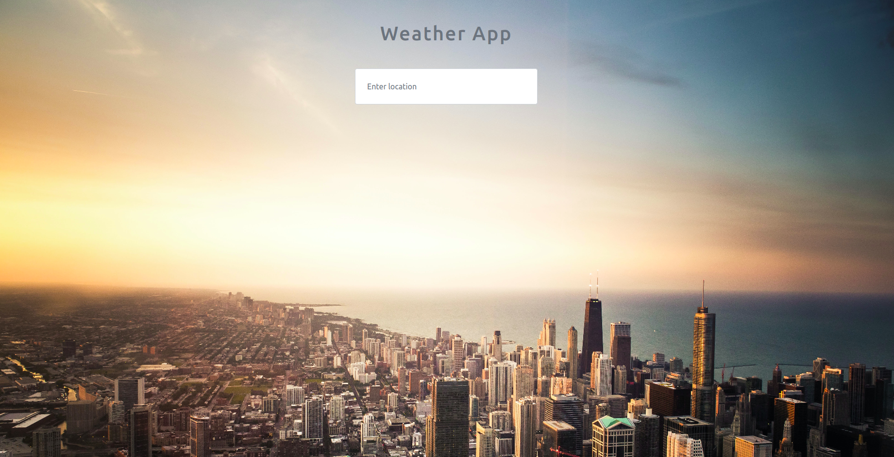

# Weather-app

A simple weather app.

User enter the location to know the weather conditions of that location

## Built With

javascript
HTML
CSS
Bootstrap

## Live Demo

[Try a live demo](https://vidhi0229.github.io/Weather-app/)

## Getting Started

Download or clone this repo by using git clone https://github.com/Vidhi0229/Weather-app.git
Enter the project folder and run locally by using a VS Code extension such as Live Server.

## Author 👤

### Vidhi Srivastava

_[Github](https://github.com/Vidhi0229)

_[LinkedIn](https://www.linkedin.com/in/vidhisrivastava01/)

## Show your support ⭐️⭐️

Give a star if you like this project!

## License 📝

This project is [MIT](https://www.mit.edu/~amini/LICENSE.md) licensed. 
